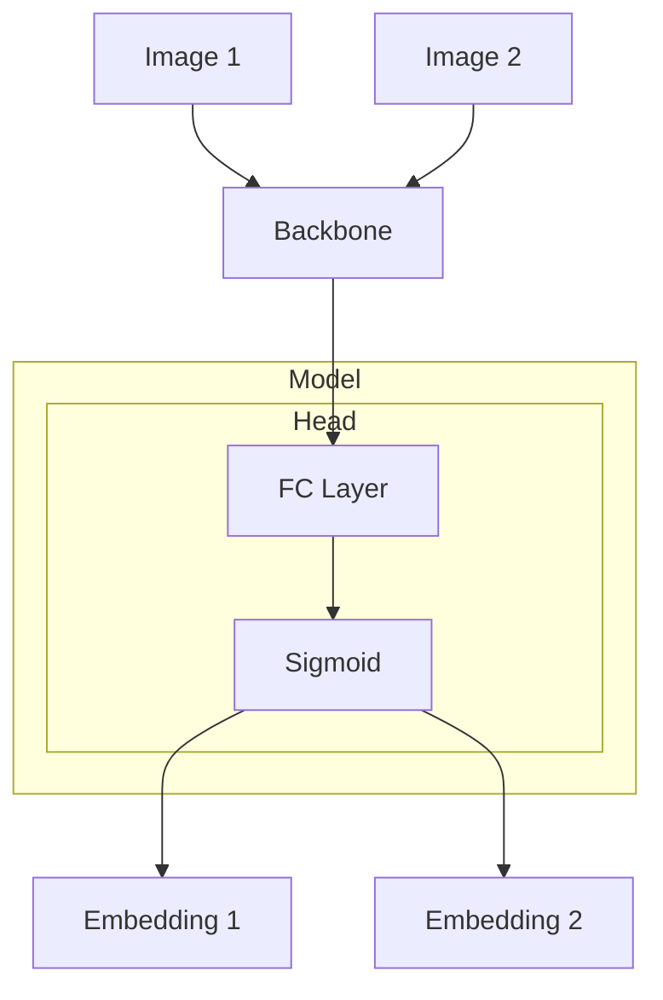
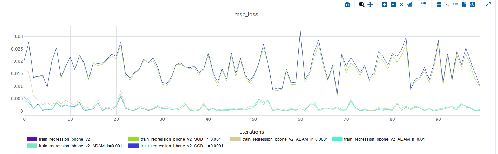
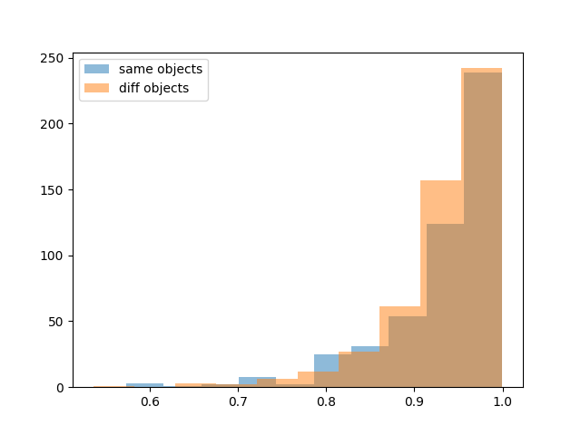
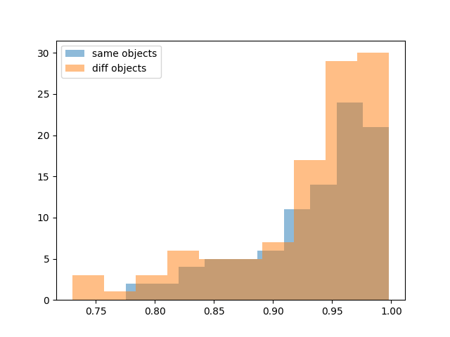
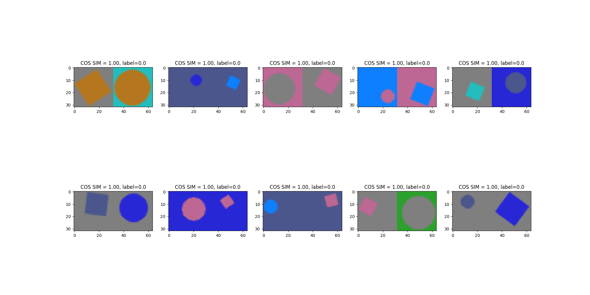
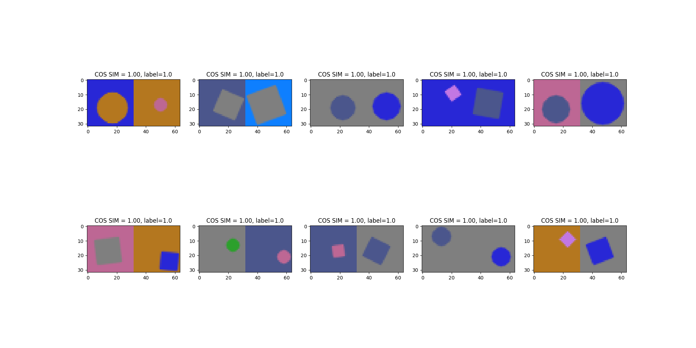
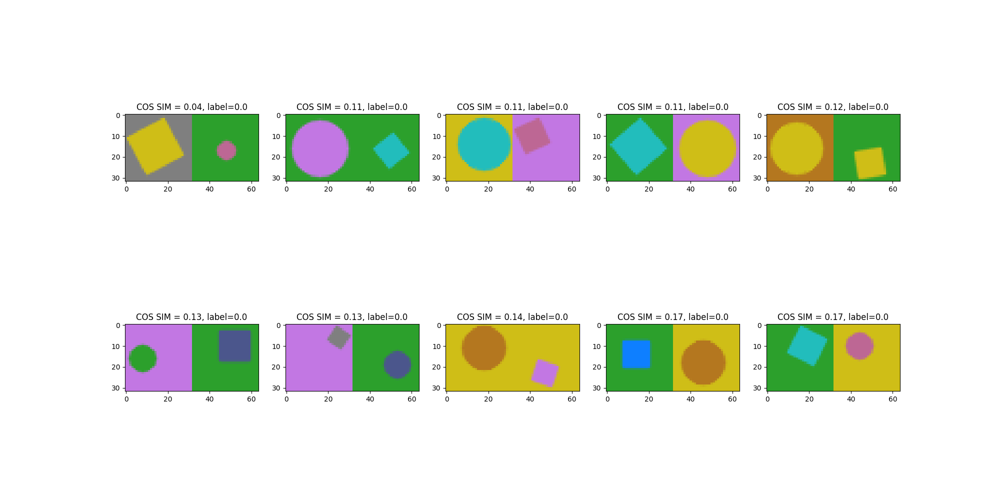
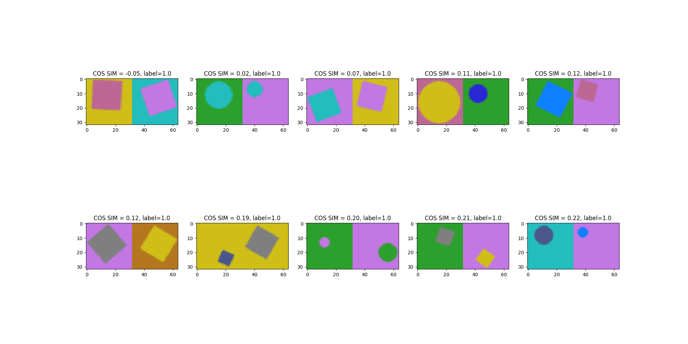

# celsus

<a target="_blank" href="https://cookiecutter-data-science.drivendata.org/">
    
</a>

celsus test task

## Project Organization

```
├── LICENSE            <- Open-source license if one is chosen
├── README.md          <- The top-level README for developers using this project.
├── configs            <- Yml configs with experiments settings.
├── data
│   ├── textures       <- Textures used for dataset generation
│   └── datasets       <- Root of project datasets 
│
├── models             <- Trained and serialized models, model predictions, or model summaries
│
├── notebooks          <- Jupyter notebooks. Naming convention is a number (for ordering),
│                         the creator's initials, and a short `-` delimited description, e.g.
│                         `1.0-jqp-initial-data-exploration`.
│
├── reports            <- Generated analysis as HTML, PDF, LaTeX, etc.
│   └── figures        <- Generated graphics and figures to be used in reporting
│
├── requirements.txt   <- The requirements file for reproducing the analysis environment, e.g.
│                         generated with `pip freeze > requirements.txt`
│
└── src                <- Source code for use in this project.
    │
    ├── __init__.py             <- Makes celsus a Python module
    ├── analytics               <- Package for analysis
    ├── cli_api                 <- CLI scripts that provide iterface for basic repo utils 
    ├── data                    <- Code for data rading/generation
    ├── nn                      <- Building block for models training
    ├── schemas                 <- Package where all schemas/intermediate data structures are defined
    ├── trian                   <- Package with training scipts defined
    └── consts.py               <- Project constants
    └── utils.py                <- Project utils
```

# Отчет по выполненным работам

## Данные

## Исходное задание

```
Написать кастомный PyTorch Dataset, который выдаёт пару изображений (32×32) и бинарный лейбл (0/1):
На каждом изображении случайно размещается либо круг, либо квадрат в случайном месте.
Лейбл: 1, если фигуры одинаковые (оба круга или оба квадрата), 0 — если разные.
```

## Выполненные работы

При генерации датасета учитывал следующее

### Разнообразие датасета

В качестве характеристик которые могут меняться у фигур выделил: размер, цвет (фигуры и фона), поворот.
В качестве вариации цветов использовал контрастную палитру из matplotlib, и для дополнительного тестового датасета использовал абстрактные текстуры для покраски фигур.  
[демо семплов](notebooks/0.3-as-figure_sample_generation_demo.ipynb)

### Качество при маленьком целевом разрешении

Чтобы установить ограничения на размер и повороты внимательно ознакомился как будут изменяться фигуры при их вариации.  Также тестировал использование antialising.  
В итоге было принято решение использовать antialiasing и ограничение минимального размера.  
[отчет_по_ограничениям_для_круга](notebooks/0.0-as-circle_AA.ipynb)
[отчет_по_ограничениям_для_квадрата](notebooks/0.1-as-square_EDA.ipynb)
[демо_генерации_фигур](notebooks/0.3-as-figure_sample_generation_demo.ipynb)

### Итоги

Получено 3 датасета, ниже приведены статистики по числу лейблов:  
train -  0-511, 1-489  
test - 0-106, 1-94  
val:  
    color - 0-56, 1-44  
    texture - 0-47, 1-53  

Для воспроизведения генерации датасета используется скрипт:
`src/cli_api/generate_datasets.py`

## Выбор стратегии решения

### Возможные варианты

Исходное задание

```
Предложить минимум 3 способа, как можно объединить информацию с двух изображений в архитектуре модели.  
```

1. Самый простой вариантСконкатенировать изображения и рассматривать задачу как классификацию, единственный плюс простота реализации  
2. Siamese network + metric learning.Сеть будет принимать на вход пару изображений и обрабатыать их общим feature_extractor, выдавая 2 эмбеддинга. Лосс будет стремиться сблизить эмбеддинги одинаковых фигур и разделить эмбеддинги разных по какой либо метрике, например, cosine similarity. Итоговый результат будет определяться по бинаризации этой метрики порогом.  
3. Адаптация базовой siamese network под задачу.
   В нашей задаче фигурируют семплы где на одной картинке изображена одна фигура, и именно это должно быть основным признаком, но в изначальной постановке задачи это не форсируется. Это может быть проблемой если, например, у нас есть семплы со сложными бекграундами и маленькими фигурами, тогда есть риск выучить ложные зависимости из бекграунда. Как вариант можно добавить дополнительный легковесный head, который  во время обучения будет оптимизировать задачу, относящуюся к нашей предметной области, и не будет использоваться после завершения обучения.  В данном варианте это будет положение фигуры на картинке, я буду реализовывать самый простой вариант => регрессия центра объекта в нормализованных координатах (loss - MSE). В качестве основного лосса будет использовться EmbeddingCosineLoss



## Реализация

### Обучение моделей

Для обучения используется torch и фреймворк pytorch_lightning, из-за его удобства и скорости разработки.

### Воспроизводимость

Для воспроизводимости используется логирование в clearml, выделение всех параметров обучения в yml специфицированный конфиг, CLI интерфейсы для основных операций.В clearml логируются:

1. Тренироворочные и валидационные семплы
2. Train/val метрики
3. Конфиг обучения

### Выбор архитектуры

В качестве backbone используется MobilenetV3, адаптированный под маленькое разрешение. Базовые блоки остаются такими же, но их количество уменьшается, также используется менее агрессивный downsampling

## Эксперименты

### Регрессор центра (успешно)

Так как в итоговом варианте будет head с регрессией центра первым экспериментом было обучить регрессор центра.
Первым этапом протестировал различные комбинации (LR с log шагом, optimizer (SGD/Adam)) для оценки сходимости loss на трейн


Провел обучение на train/val, после оценил лучший чекпоинт отдельно на тесте с цветными изображениями и текстурами. Для анализа посчитал MSE и отрисовал топ лучших и худших предсказаний. В итоге высокий перформанс сохранился на тесте, но на тесте из другого домена (изображения с текстурами), модель показала себя сильно хуже на семплах со сложным бекграундом.
[отчет](notebooks/1.0-as-demo_center_regression_training.ipynb)

### Обучение сиамской сети (неудачный)

Начал с обучения сиамской сети без регрессионного хеда как бейзлайн решения

#### Оценка качества

Для оценки качества задача сводится к задаче классификации, где лейбл это число из {0, 1}, а предсказанный score это cosine_similarity между эмбеддингами, таким образом считаем PR кривую и процессе обучения логируем лучший F1 и соответствующие ему prcn, rcl, thresholds
[пример_рана](https://app.clear.ml/projects/fcd61b2d4f8f4a19b16d82e73646d804/experiments/90343cc1da1d47eabbb175e502bc0d7b/output/execution)

При первом обучении получил не очень высокий F1 ~0.65, и при этом самый оптимальный порог был близок единице. Сразу возникли подозрения что все эмбеддинги в итоге близко к друг другу, поэтому их можно разделить только околоединичным порогом. Для проверки гипотезы отрисовал распределения cosine similarity в парах одинаковых и разных объектов. В итоге опасения подтвердились, понял что нужно дебажить.  
<Details>

**Скоры на трейне**



**Скоры на валидации**



</Details>

#### Использованные методы дебага

**Перепроверил данные**
Посмотрел на залогированные семплы, все лейблы корректные

**Оверфит на маленьком датасете**
Добавил в пайплайн данных возможность брать где будет только 1 лейбл и возможность выделять сабсет
Поскольку до этого у меня не получилось добиться низкой cosine similarity у разных объектов, запустил тестовый оверфит на одной паре с разными объектами. Получил странный эксперимент где cosine_similarity стабильно близко к единице и лосс не падает

**Мониторинг градиентов**
Чтобы посмотреть нету ли проблем с градиентами, добавил дебажный callback печатающий средний градиент для каждого слоя. Проверил что required_grad=True, но заметил что градиенты близки к 0, сразу подумал провести эксперимент со скейлом лосса сильным увеличением LR

**Логирование cosine_similarity**
Добавил дебажный callback с логированием подобных гистограмм

**Форсирование сильных изменений при обучении**
Пробовал высокие значения LR и домножение loss на коэффициент (10, 100, 1000)

**Анализ фейлов**  
Смотрел топ похожих/отличающихся для одинаковых и разных объектов, закономерности на первый взгляд нет, очевиные гипотезы что модель путает цвет/положение в на изображении, кажется не оправдались, модель может как путать разные фигуры одного цвета так и не различать одинаковые фигуры одного цвета.
<Details>

**Ближайшие разные**  


**Ближайшие одинаковые**


**Дальние разные**


**Дальние одинаковые**
  
</Details>   

**Дефолтный MobileNetV3**
Возможно кастомная модификация сильнее уязвима к исчезающим градиентам и имеет смысл откатиться на исходный MobileNet в качестве feature extractor (маловероятно так как на задаче регрессии центра такой проблемы не было)


Пока ставлю, что какой то баг, который прошел незамеченным  
